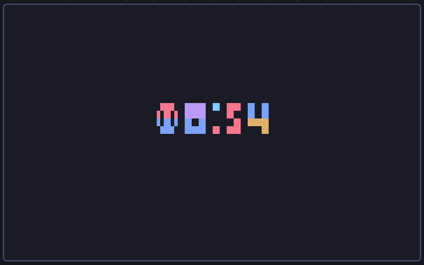

# Tuime


A simple clock for your terminal made using Rust  
## Installation
If you have the Rust toolchain
```sh 
cargo install --git=https://github.com/nate-sys/tuime

# or

git clone https://github.com/nate-sys/tuime
cd tuime
cargo build --release
mv ./target/release/tuime /usr/local/bin/tuime
```

If you don't have the rust toolchain, there are pre-built binaries in the releases section.

## Usage

```
Usage: tuime [OPTIONS]

Options:
      --format <FORMAT>
          Format the time

          [default: %H:%M]

  -c, --colors <COLORS>
          Supply a color to use for rendering

          If the font supports it you may supply mutliple colors : -c red -c green ...
          To see what fonts support multiple colors, see https://github.com/dominikwilkowski/cfonts"

          Possible values:
          - system:
            Uses the system font defined by your console
          - black
          - red
          - green
          - yellow
          - blue
          - magenta
          - cyan
          - white
          - gray
          - red-bright
          - green-bright
          - yellow-bright
          - blue-bright
          - magenta-bright
          - cyan-bright
          - white-bright
          - candy:
            A color that randomizes it's colors from a set of bright candy-like color set

  -f, --font <FONT>
          Set the font
          To see what fonts you can use, go to https://github.com/dominikwilkowski/cfonts"

          [default: font-block]
          [possible values: font-console, font-block, font-simple-block, font-simple, font3d, font-simple3d, font-chrome, font-huge, font-shade, font-slick, font-grid, font-pallet, font-tiny]

  -g, --gradient <GRADIENT>
          Set a gradient instead of regular colors : -g "#ffaabb" -g "#ee22ff" ..."

  -u, --utc-offset <UTC_OFFSET>
          Set the utc offset

          If this argument is not supplied, we will try to use the local time
          Supplied as +/-<secs>. Eg: tuime -u="-3600", tuime -u="+7200"

  -s, --screensaver
          Screensaver mode

  -h, --help
          Print help (see a summary with '-h')

  -V, --version
          Print version
```

### Red and Black with Regular Font
```sh
tuime -c Red -c Black
```


### Blue with Shade Font and Formatted time
```sh
tuime -c Blue --format "%H:%M:%S" -f shade
```


### Colorful with Tiny Font
```sh
tuime -c Candy -f Tiny
```


### Gradient and 3d Font
```sh
tuime -f Simple3d -g '#ffe' -g '#3af'
```

